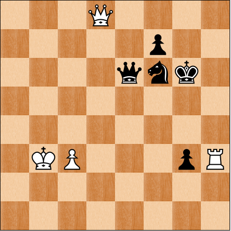

# Chess Parser

Given a square image of a chess board, identify all pieces and positions,
then output them in machine-readable format.

## Example

**Input**:



**Output**:

```
White Queen  d8
Black Pawn   f7
Black King   e6
Black Knight f6
Black Queen  g6
White Queen  b3
White Pawn   c3
Black Pawn   g3
White Rook   h3
```

## Installation

If you are on Mac OS X
```
brew install phash homebrew/python/pillow   # READ OUTPUT, FOLLOW DIRECTIONS
sudo pip install phash
```

If you are on Linux (Debian, Ubuntu, etc)
```
apt get install libphash0 libphash0-dev
sudo pip install phash
```

And if you are on some other Linux distribution, chances are
you are smart enough to figure out how to install the phash
library.

If you are on Windows, you can use MinGW or Cygwin, or just
set up VM running Linux.
